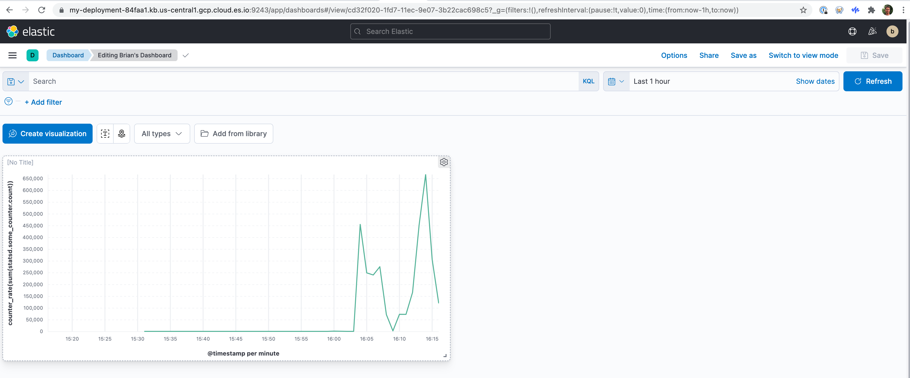

# Elastic Observability

* [https://www.elastic.co/observability](https://www.elastic.co/observability)

# Logs

# Metrics

## Send statsd metrics from app to Kibana

My goal is to send statsd metrics from a node app to Elastic Stack (the Kibana dashboard UI). Elastic has a [free training course](https://learn.elastic.co/learn/course/391/play/1428:844/lesson-1-elastic-observability) with a lab feature that gives instructions on how to deploy an Elastic Stack.

## Install, configure, and start Metricbeat

Metricbeat can convert statsd to Elastic APM. Install [Metricbeat](https://www.elastic.co/guide/en/beats/metricbeat/current/metricbeat-installation-configuration.html) and enable the statsd module.

```
curl -L -O https://artifacts.elastic.co/downloads/beats/metricbeat/metricbeat-7.15.0-darwin-x86_64.tar.gz
tar xzvf metricbeat-7.15.0-darwin-x86_64.tar.gz
cd metricbeat-7.15.0-darwin-x86_64
./metricbeat modules enable statsd
```

Edit `./metricbeat.yml` to set these two fields. You get the values from the Elastic Service you deployed (Manage deployments link in the UI.) The username and password are presented on the screen while you create your deployment.

```
cloud.id: "<copy/paste from Elastic Deployments UI>"
cloud.auth: "<username>:<password>"
```

and comment out various lines :-(

```
# setup.kibana:
...
# output.elasticsearch:
  # hosts: ["localhost:9200"]
```

Edit `./modules.d/statsd.yml`

```
  enabled: true
```

Then you can successfully...

```
$ metricbeat setup -e
Kibana url: https://***.us-central1.gcp.cloud.es.io:443
Kibana dashboards successfully loaded.
Loaded dashboards
```

```
$ sudo chown -R root *
$ sudo ./metricbeat -e
Started listening for UDP on: 127.0.0.1:8125
```

## Run example app

Install the statsd-client...

```
npm install statsd-client
```

The app code is simply...

```
var SDC = require('statsd-client'),
	sdc = new SDC({host: 'localhost', port: 8125});

function sleep(ms) {
  return new Promise((resolve) => {
    setTimeout(resolve, ms);
  });
}

async function main() {
	while(true){
		const n = Math.floor(Math.random() * 1000);
		console.log(`incrementing some_counter by ${n}`);
		await sdc.counter('some_counter', n);
		await sleep(80);
	}
}

main();
```

Save that to app.js and then run it with...

```
node app.js
```

## Create a dashboard in Kibana

The Elastic UI has "My deployment" and a quick link to Kibana. Follow that link and click on Analytics and then Dashboard. Click the Create Dashboard button and then Create Visualization. For index pattern choose `metricbeat-*`, then filter by "some" and drag `statsd.some_counter.count` into the middle area. On the right side choose Line, then click Vertical axis and in formula type `counter_rate(sum(statsd.some_counter.count))`. Save the visualization and the dashboard. You should see something along the lines of this



# Application Performance Management
